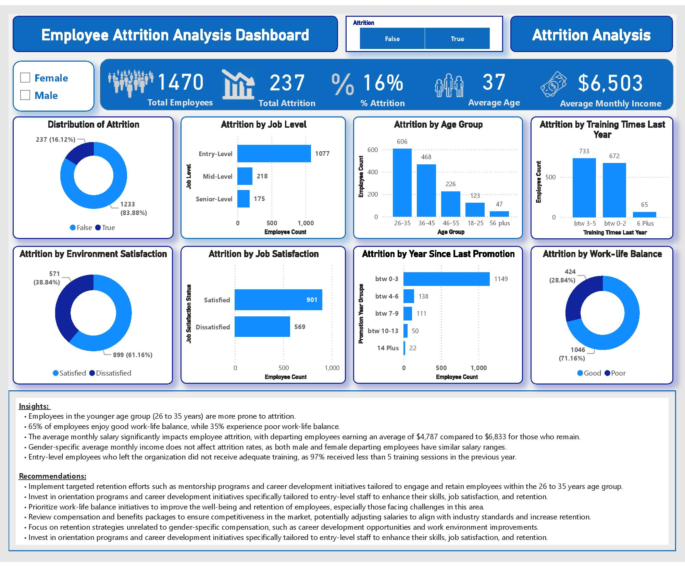

💼 Employee Attrition Prediction Using Machine Learning

This project predicts whether an employee will leave the company using HR analytics data. It provides actionable insights for HR teams to improve employee retention and engagement.

  

🧩 Project Overview
Component	Description
Jupyter Notebook	Complete analysis and model building with visualizations.
Web App	Interactive Streamlit app to make attrition predictions.
Insights & Recommendations	Key findings from the data with actionable HR suggestions.
Deployment	Fully deployed web app for real-time prediction.
📊 Dataset

The dataset includes attributes related to employee demographics, compensation, work-life balance, and performance. Key features include:

Age – Employee age group

Job Role – Department/position

Monthly Income – Salary information

Job Satisfaction – Satisfaction rating 1–4

Work-Life Balance – Rating 1–4

OverTime – Whether the employee works overtime

Training Sessions – Number attended last year

Attrition – Target variable (Yes/No)

Source: IBM HR Analytics Attrition Dataset on Kaggle

🚀 Key Steps

Data Preprocessing

Clean missing values

Encode categorical variables

Scale numeric features

Exploratory Data Analysis (EDA)

Visualize trends and correlations

Identify key drivers of attrition

Model Development

Baseline: Logistic Regression

Advanced: Random Forest, XGBoost

Evaluate accuracy, F1-score, ROC-AUC

Insights & Recommendations

Highlight the main factors affecting attrition

Suggest HR strategies for retention

Deployment

Streamlit app for real-time prediction

📊 Key Insights

Age and Attrition – Younger employees (26–35) more likely to leave.

Work-Life Balance – Employees with poor balance have higher attrition risk.

Salary – Lower-paid employees are more likely to leave; gender doesn’t affect attrition.

Training – Entry-level employees with less than 5 training sessions per year are at higher risk.

📝 Recommendations

Mentorship & Career Development – Target younger and entry-level employees.

Work-Life Balance Programs – Improve well-being and retention.

Competitive Compensation Packages – Align salaries with market standards.

Enhanced Training Programs – Upskill employees for satisfaction and retention.

📁 Project Structure
Employee-Attrition-Prediction-Using-ML/
│
├── data/
│   └── employee_data.csv          # Dataset
├── notebooks/
│   └── Employee_Attrition.ipynb   # EDA & model
├── scripts/
│   ├── data_preprocessing.py      # Cleaning & preprocessing
│   └── visualization.py           # Custom plots
├── app/
│   └── streamlit_app.py           # Deployed app
├── screenshots/
│   ├── before_prediction.jpeg
│   └── after_prediction.jpeg
├── README.md                       # Project description
└── requirements.txt                # Dependencies

⚡ Run Locally

Clone the repo:

git clone https://github.com/YOURUSERNAME/Employee-Attrition-Prediction-Using-ML.git

Install dependencies:

pip install -r requirements.txt

Run preprocessing (optional):

python scripts/data_preprocessing.py

Open notebook for analysis:

jupyter notebook notebooks/Employee_Attrition.ipynb

Run Streamlit app:

streamlit run app/streamlit_app.py

📈 Results

Random Forest Accuracy: 88%

Key Drivers: Overtime, Job Satisfaction, Monthly Income

💼 Resume Summary

Built an end-to-end machine learning project to predict employee attrition using HR analytics data, achieving 88% accuracy and providing actionable insights for HR retention strategies.

⚙️ Dependencies
pandas
numpy
matplotlib
seaborn
scikit-learn
xgboost
streamlit
jupyter

License

MIT License
